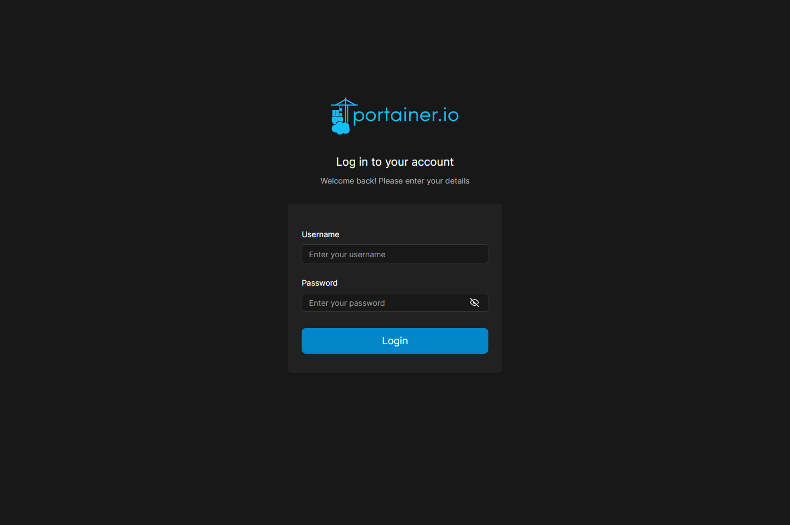
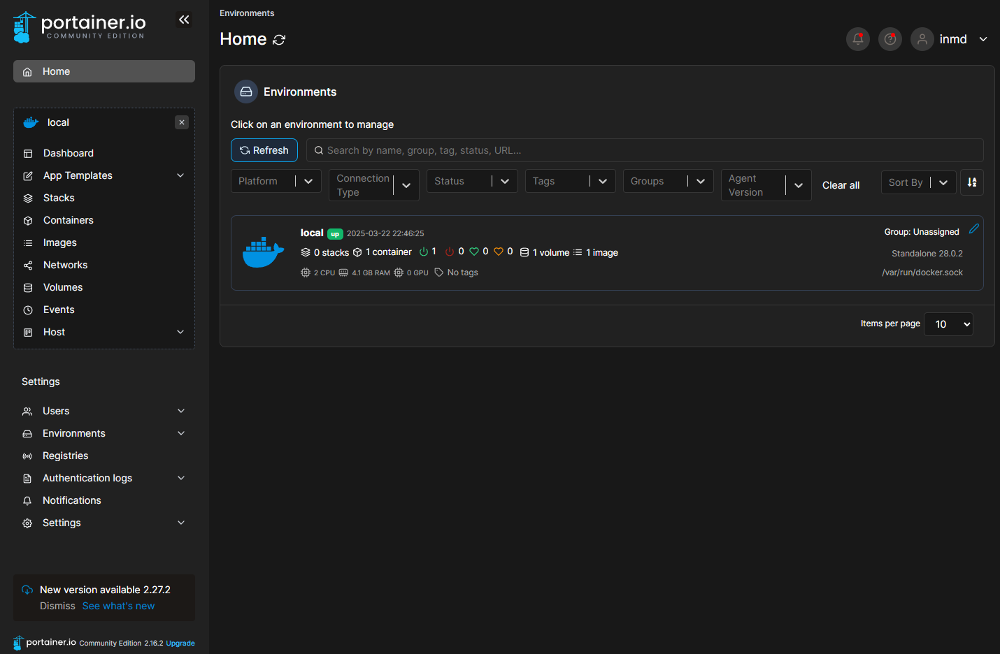
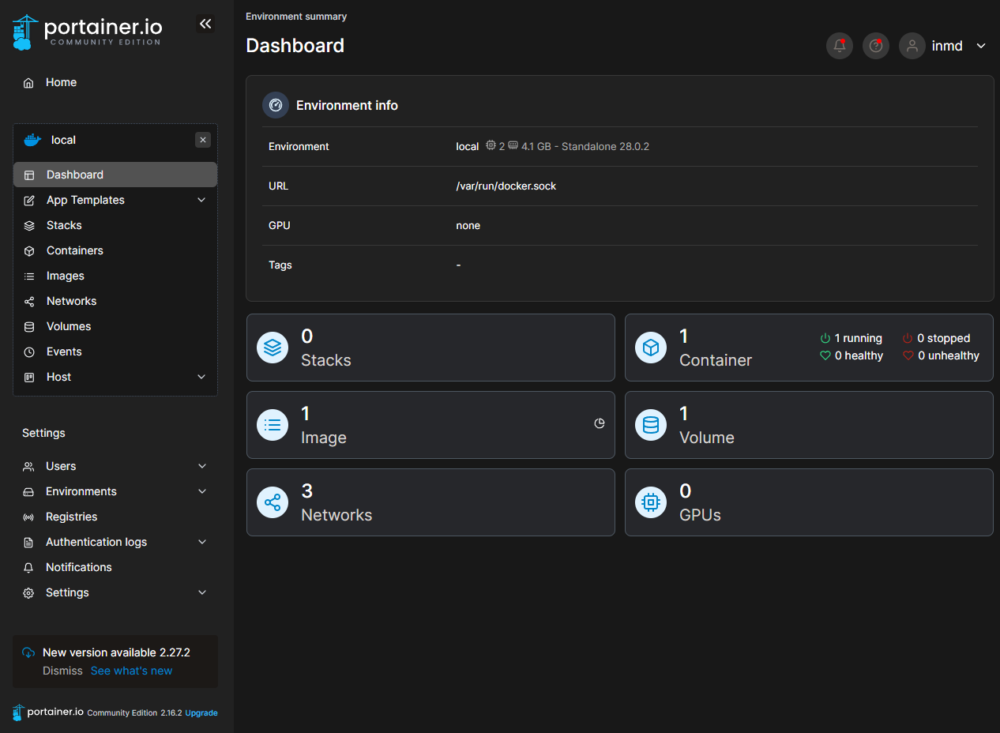
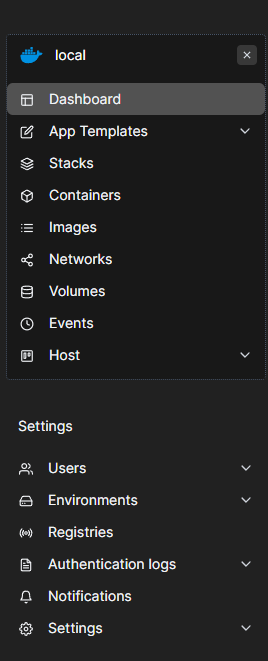

# 1. Portainer란? [간단 설명]

Portainer는 Docker 및 Kubernetes를 손쉽게 관리할 수 있는 웹 기반 UI 도구입니다. 컨테이너, 볼륨, 네트워크 등을 쉽게 모니터링하고 관리할 수 있습니다.

# 2. Portainer 접속

Portainer에 접속하려면 웹 브라우저를 열고 Portainer가 실행 중인 도메인을 입력합니다.

```
https://doddb.aswdod.kro.kr/
```

# 3. Portainer 로그인



관리자한데 받은 계정을 이용을해서 로그인을 합니다.



# 3. Portainer 메인 페이지 설명



## 3.1 대시보드 (Dashboard)



Portainer에 로그인하고 local 부분의 Box를 눌으면 기본적으로 **대시보드** 페이지가 나타납니다.

### 주요 정보

- **Endpoints (엔드포인트)**: 관리 중인 Docker/Kubernetes 노드 목록
- **Containers (컨테이너 수)**: 현재 실행 중인 컨테이너 개수
- **Images (이미지 수)**: 로컬에 저장된 Docker 이미지 개수
- **Volumes (볼륨 수)**: Docker 볼륨 개수
- **Networks (네트워크 수)**: Docker 네트워크 개수

---

# 4. 주요 메뉴 설명 [자주쓰는 버튼으로 설명]



## 4.1 Environments (환경)

- Docker 또는 Kubernetes 클러스터를 관리하는 페이지
- 새 환경 추가 가능 (`Add environment`)
- 이미 추가된 환경의 설정 수정 가능

### 4.2 Containers (컨테이너)

- 현재 실행 중인 Docker 컨테이너 목록 확인
- 컨테이너 시작/중지, 삭제 등의 관리 가능
- `+ Add container` 버튼을 통해 새로운 컨테이너 생성 가능

### 컨테이너 상세 정보

- **Name**: 컨테이너 이름
- **State**: 실행 중 (running) / 중지됨 (stopped)
- **Image**: 컨테이너에서 사용 중인 Docker 이미지
- **Ports**: 컨테이너의 공개 포트 정보
- **Logs**: 컨테이너의 로그 확인

---

## 4.3 Images (이미지)

- 로컬에 저장된 Docker 이미지 목록 확인
- `Pull image` 버튼으로 새로운 이미지 다운로드 가능
- `Remove` 버튼으로 사용하지 않는 이미지 삭제 가능

---

## 4.4 Volumes (볼륨)

- Docker 볼륨 관리 메뉴
- `Create volume`을 통해 새로운 볼륨 생성 가능
- 기존 볼륨을 삭제하거나 내부 데이터를 탐색 가능

---

## 4.5 Networks (네트워크)

- Docker 네트워크 관리
- `Create network` 버튼으로 새로운 네트워크 생성 가능
- 컨테이너 간 네트워크 연결 설정 가능

---

## 4.6 Users (사용자)

- Portainer에 접근할 수 있는 사용자 관리
- 관리 권한을 가진 사용자 추가 가능
- 역할(Role)을 설정하여 권한을 제어 가능

---

# 5. Portainer 설정 (Settings)

- **Authentication**: 로그인 방식 설정 (LDAP, OAuth 등)

---

