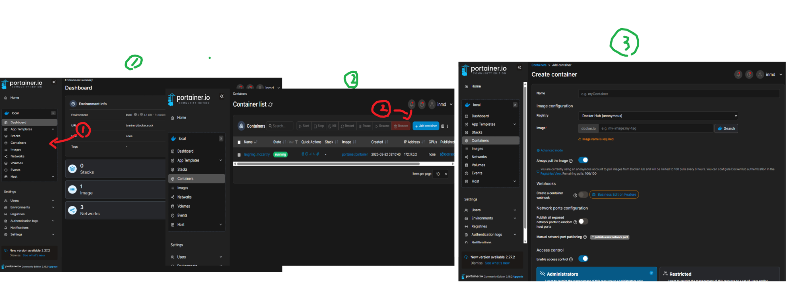
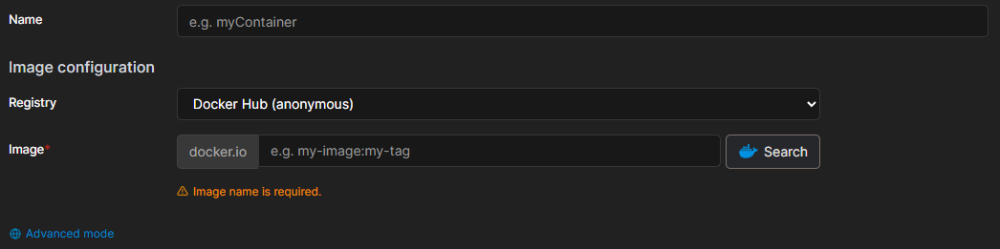
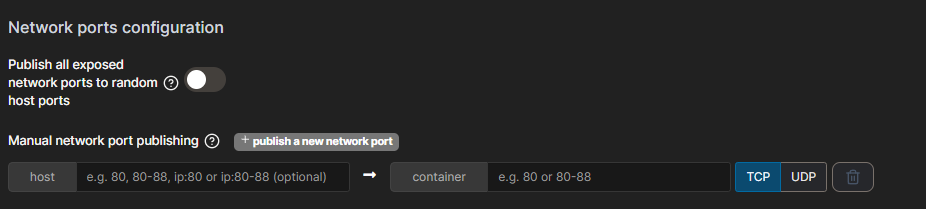
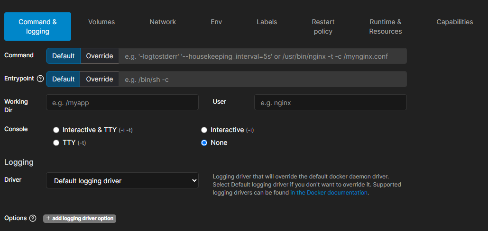
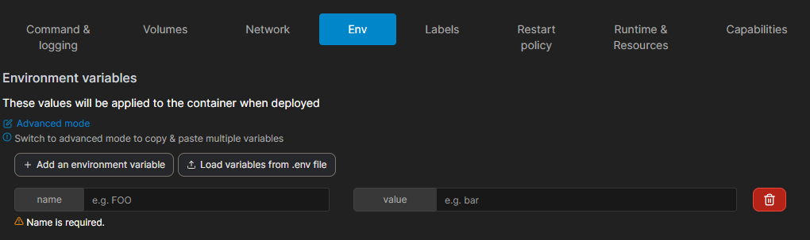

# 1. 컨테이너 제작 페이지 이동



- 데시보드 옆 화면에서 Conatiners 버튼을 클릭 합니다.
- 우측 상단에 보이는 Add container 버튼을 누룸니다.
- 컨테이너 제작 페이지로 이동 했습니다.

# 2. 컨테이너 설정



### 2.1 컨테이너 이름 설정

- `Container Name`에 컨테이너 이름 입력  
  예: `my-app`

### 2.2 Docker 이미지 선택

- `Image`에 사용할 Docker 이미지 입력  
  예: `nginx:latest`
- `Pull the image before creating the container` 체크 시 최신 이미지 다운로드 후 실행

### 2.3 명령어 설정 (선택)

- `Entrypoint` 및 `Command` 설정 가능
  <br/><br/>

# 3. 포트 매핑 설정



1. `Publish a new network port` 클릭
2. **Host**와 **Container** 포트 매핑 설정  
   예: `80` (Host) → `80` (Container) (Nginx 사용 시)
3. 여러 개의 포트를 매핑해야 할 경우 `+ Publish a new network port` 클릭하여 추가
   <br/><br/>

# 4. Advanced container settings



### 4.1.1 명령어 설정



Portainer에서는 컨데이너 실행시 특정명령어를 지정할려면 **Entrypoint**와 **Command**를 설정할 수 있습니다.

#### 🛠 Entrypoint vs Command 차이점

|----------|------|------|
| 설정 항목 | 설명 | 예시 |
|----------|------|------|
| Entrypoint | 컨테이너가 실행될 때 항상 실행되는 기본 프로그램 (고정됨) | `/bin/sh -c` |
| Command | Entrypoint가 실행될 때 추가로 전달할 명령어 (덮어쓰기 가능) | `nginx -g 'daemon off;'` |

---

### 4.1.2 Entrypoint 설정

- 컨테이너가 실행될 때 가장 먼저 실행될 프로그램을 지정합니다.
- **Entrypoint가 설정되면 기본적으로 덮어쓰기가 어렵습니다.**
- 예를 들어, `python` 이미지를 사용할 때 기본 실행 파일을 변경하려면 다음과 같이 설정할 수 있습니다.

  ```plaintext
  Entrypoint: /usr/local/bin/python
  ```

---

### 4.1.3 Command 설정

- Entrypoint에서 실행할 명령어나 추가 인자를 설정합니다.
- 기본적으로 Entrypoint가 실행될 때 뒤에 붙는 옵션이라고 생각하면 됩니다.
- 예를 들어, `nginx`를 포그라운드 모드로 실행하려면:

  ```plaintext
  Command: nginx -g 'daemon off;'
  ```

- `python` 컨테이너에서 특정 스크립트를 실행하려면:

  ```plaintext
  Command: app.py
  ```

---

#### ✅ 예제 1: Nginx 컨테이너 실행

```plaintext
Entrypoint: nginx
Command: -g 'daemon off;'
```

- `nginx`를 실행하면서 백그라운드 모드가 아닌 **포그라운드 모드**로 실행

#### ✅ 예제 2: Python 컨테이너 실행

```plaintext
Entrypoint: /usr/local/bin/python
Command: app.py
```

- Python 실행 파일을 실행하고, `app.py`를 실행하는 방식

#### ✅ 예제 3: Bash 셸 실행 (디버깅 용도)

```plaintext
Entrypoint: /bin/sh
Command: -c "echo Hello, World!"
```

- 컨테이너 실행 시 `echo Hello, World!` 출력 후 종료

---

### 4.1.4 Entrypoint 없이 Command만 사용하면?

만약 Entrypoint를 설정하지 않고 Command만 입력하면,  
해당 이미지를 실행할 때 **기본 Entrypoint**가 사용됩니다.

예를 들어 `ubuntu` 컨테이너에서 기본 쉘을 실행하려면:

```plaintext
Command: /bin/bash
```

### 4.2.1 ENV 설정



1. `+ add environment variable` 버튼 클릭
2. `Name`에 환경 변수 키 입력 (예: `NODE_ENV`)
3. `Value`에 해당 변수의 값 입력 (예: `production`)
4. 여러 개의 환경 변수를 추가하려면 `+ add environment variable` 버튼을 반복해서 클릭하여 추가
