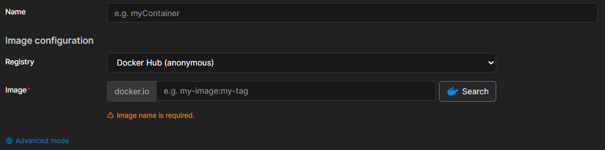
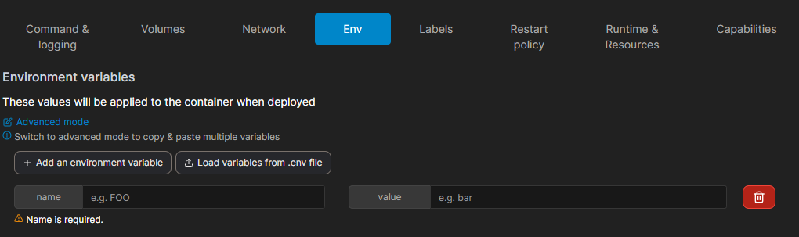

# MySQL 사용을 위한 기본 지식

MySQL 컨테이너를 효과적으로 관리하기 위해서는 아래와 같은 개념이 있어야 관리 및 이용이 편리합니다.

- 데이터베이스, 테이블, 사용자 계정 등 MySQL의 기본 구성 요소
- SQL 쿼리 문법
- 데이터베이스 백업 및 복원 개념

> 위 내용들은 https://dev.mysql.com/doc/ 에서 알아볼수 있습니다. <br/>
> 책이나 인터넷에 찾아보는것도 좋은 방법입니다.

# 1. Portainer 접속 및 기본 탐색

이내용은 여기에 자세하게 기재를 헀기때문에 넘어감니다.

> [https://doddb-docs.aswdod.kro.kr/docs/howtomakecontainer]("https://doddb-docs.aswdod.kro.kr/docs/howtomakecontainer")

# 2. Mysql 컨테이너 생성



컨테이너 생성 페이지가 열리면 다음 기본 정보를 입력합니다:

1. **이름(Name)**: 컨테이너의 이름을 입력합니다. 예: `mysql-db` (아무거나 써도 상관없습니다.)
2. **이미지(Image)**: `mysql` 또는 특정 버전을 지정하려면 `mysql:8.0`과 같이 입력합니다.

> 특정 버전을 설치하고 싶은경우 [https://hub.docker.com/\_/mysql/tags](https://hub.docker.com/_/mysql/tags)에 들어가서 버전을 확인후 설치해주세요.

# 3. 포트 매핑 설정

MySQL 서버에 외부에서 접속하기 위한 포트 매핑을 설정합니다:

1. **'포트 매핑(Port mapping)'** 섹션에서 **'publish a new network port'** 버튼을 클릭합니다.
2. **호스트(Host)**: 호스트 시스템에서 사용할 포트 번호 (일반적으로 3306)
3. **컨테이너(Container)**: MySQL 컨테이너의 내부 포트 (3306)

호스트 시스템에서 이미 3306 포트가 사용 중이라면, 다른 포트(예: 13306)를 호스트 포트로 지정할 수 있습니다.






# 4. 환경 변수 설정


MySQL 컨테이너에 필요한 환경 변수를 설정합니다:

1. **환경 변수 섹션**에서 다음 변수들을 추가합니다:
   - `MYSQL_ROOT_PASSWORD`: (필수) MySQL 루트 계정의 비밀번호
   - `MYSQL_DATABASE`: (선택) 자동으로 생성할 데이터베이스 이름
   - `MYSQL_USER`: (선택) 생성할 새 사용자 이름
   - `MYSQL_PASSWORD`: (선택) 새 사용자의 비밀번호

2. 다른 변수 설명

#### MYSQL_ALLOW_EMPTY_PASSWORD
이 변수는 선택 사항입니다. 루트 사용자의 빈 비밀번호로 컨테이너를 시작할 수 있도록 예와 같이 비어 있지 않은 값으로 설정합니다. 참고: 이 변수를 예로 설정하는 것은 MySQL 인스턴스가 완전히 보호되지 않으므로 누구나 완전한 슈퍼유저 액세스를 할 수 있으므로 실제로 무엇을 하고 있는지 알지 못하면 권장되지 않습니다.

#### MYSQL_RANDOM_ROOT_PASSWORD
이것은 선택 변수입니다. 루트 사용자를 위한 랜덤 초기 비밀번호를 생성하려면 예와 같이 비어 있지 않은 값으로 설정합니다(openssl을 사용하여). 생성된 루트 비밀번호는 stdout으로 출력됩니다(생성된 루트 비밀번호: ...).

#### MYSQL_ONETIME_PASSWORD
초기화가 완료되면 루트 사용자(MYSQL_USER에 지정된 사용자가 아님)를 만료된 것으로 설정하여 첫 로그인 시 비밀번호를 변경해야 합니다. 비어 있지 않은 값은 이 설정을 활성화합니다. 참고: 이 기능은 MySQL 5.6+에서만 지원됩니다. MySQL 5.5에서 이 옵션을 사용하면 초기화 중 적절한 오류가 발생합니다.

#### MYSQL_INITDB_SKIP_TZINFO
기본적으로 진입점 스크립트는 CONVERT_TZ() 함수에 필요한 시간대 데이터를 자동으로 로드합니다. 필요하지 않은 경우 비어 있지 않은 값은 시간대 로드를 비활성화합니다

# 5. 볼륨 설정 [옵션]


데이터 영속성을 위해 볼륨을 설정합니다. MySQL 컨테이너는 데이터를 `/var/lib/mysql` 디렉토리에 저장하므로 이 디렉토리를 볼륨과 연결해야 컨테이너가 삭제되어도 데이터가 유지됩니다.

1. **'볼륨(Volumes)'** 섹션에서 **'Add volume'** 버튼을 클릭합니다.
2. 다음 두 가지 방법 중 하나를 선택합니다:

**방법 1: 바인드 마운트 (호스트 디렉토리 사용)**

- **컨테이너**: `/var/lib/mysql`
- **호스트**: `/path/to/mysql/data` (호스트 시스템의 실제 경로)
- **읽기 전용**: 체크하지 않음

**방법 2: Docker 볼륨 사용 (권장)**

- 먼저 **'Volumes'** 메뉴에서 볼륨을 생성합니다(예: `mysql-data`).
- **컨테이너**: `/var/lib/mysql`
- **볼륨**: 드롭다운에서 생성한 볼륨 선택
- **읽기 전용**: 체크하지 않음[^8][^9]

# 6. 한글 지원을 위한 문자셋 설정

MySQL이 한글을 올바르게 지원하도록 문자셋을 설정합니다. 다음 두 가지 방법 중 하나를 선택할 수 있습니다:

**방법 1: 명령어로 설정**

고급 설정의 **'Command \& logging'** 섹션에서 **'Command'** 필드에 다음을 입력합니다:

```
--character-set-server=utf8mb4 --collation-server=utf8mb4_unicode_ci
```

**방법 2: 설정 파일 사용**


1. 호스트 시스템에 `my.cnf` 파일을 생성합니다:
```
[mysqld]
character-set-server=utf8mb4
collation-server=utf8mb4_unicode_ci

[client]
default-character-set=utf8mb4

[mysql]
default-character-set=utf8mb4
```

2. **'볼륨(Volumes)'** 섹션에서 추가 볼륨을 설정합니다:
    - **컨테이너**: `/etc/mysql/conf.d/my.cnf`
    - **호스트**: 호스트 시스템에 생성한 my.cnf 파일의 경로

# 7. MySQL 컨테이너 배포 및 확인

### 배포 버튼 클릭


모든 설정을 완료한 후, 페이지 하단의 **'Deploy the container'** 버튼을 클릭하여 MySQL 컨테이너를 생성하고 시작합니다

### 컨테이너 상태 확인

1. 컨테이너 목록 페이지로 돌아가면 새로 생성된 MySQL 컨테이너가 표시됩니다.
2. **'Status'** 열에서 컨테이너의 상태를 확인할 수 있습니다. 정상적으로 실행 중이면 녹색으로 표시됩니다.